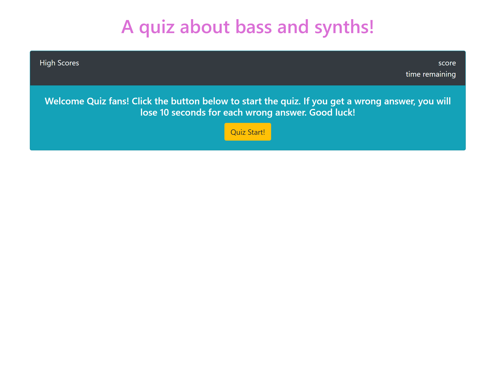
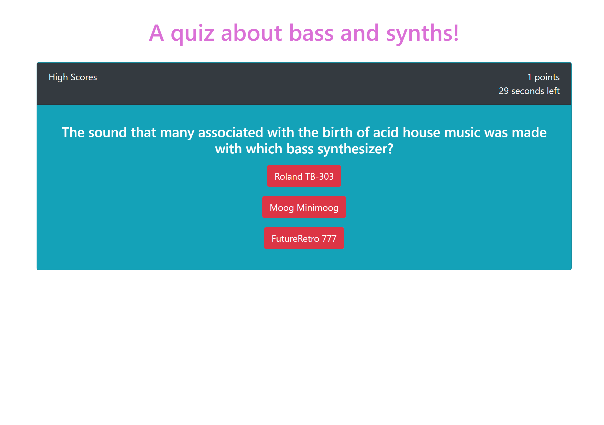
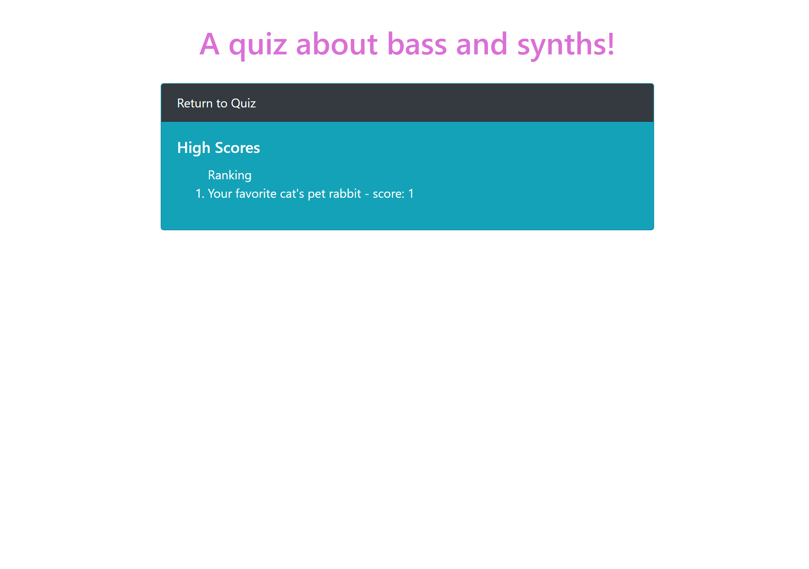

# 04-HW-Code-Quiz
04 Homework - Code Quiz Web APIs

### Objective

Create a timed quiz game that awards points for correct answer and penalizes users by taking time away from the over time for the quiz.
Use vanilla JavaScript, HTML, and css/Bootstrap.

[Link to HW 4](https://samfan808.github.io/04-HW-Code-Quiz/)

Screenshot below:

